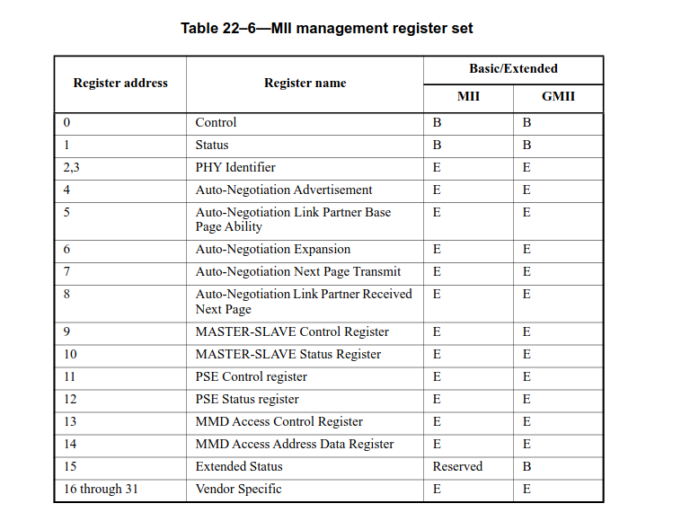
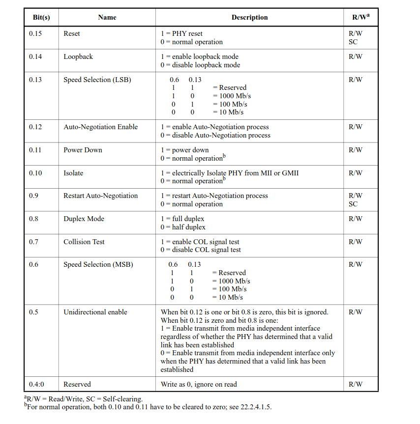
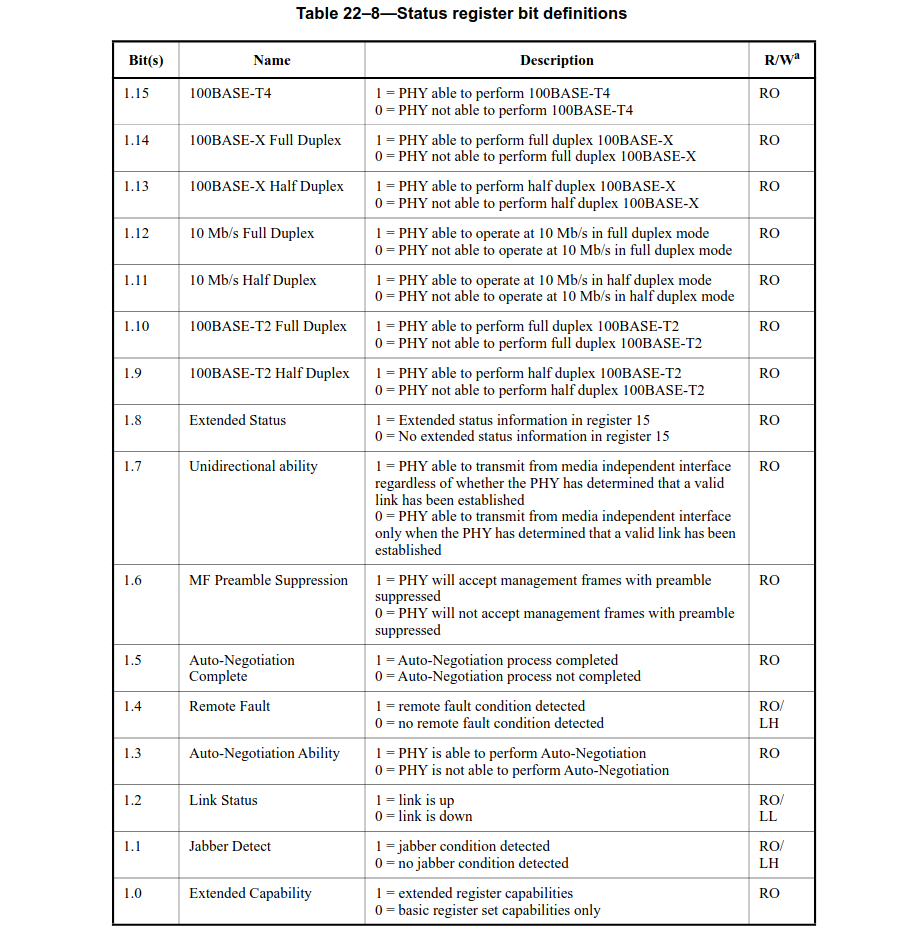
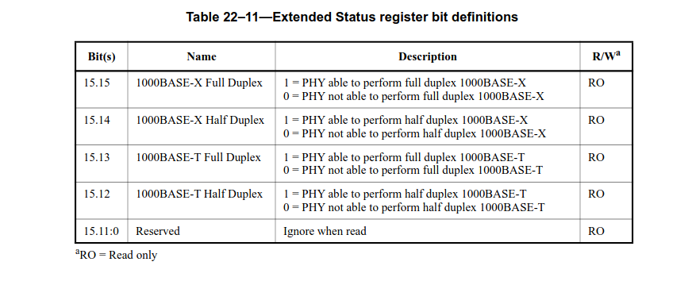

# BCM54213PE Driver Reverse Engineer

* BCM54213PE driver loc -> linux-*/drivers/net/phy/broadcom.c
* installed phytool and ethtool from buildroot packages menu
* `include/linux/brcmphy.h` contains the register definitions for the PHY
* `include/linux/phy.h` contains includes for phy_read, phy state mahcine, etc.
* `drivers/net/phy/phy_device.c` contains generic phy driver device code

# Code Set Up

## Refactor Code

The first thing we want todo is refacor the code. Also we need a dedicated place for this code to reside. So we moved the official files into the `external_packages/ethraw` directory and depricated the first version contained in `P1.1`. Next we did the following:

* Created library `libEth` with common code
* Removed as much global state as possible
* Turned consts into #define's
* Added the packet generation params as input args
* Removed CRC display code and any mention of CRC
* Removed options to dump whole packet as this isn't required.

Finally, with the scripts developed in part 1, we can cross compile and send the newly factored code to the PI with the following (making sure it is powered on and logged into):

```bash
source ./scripts/env_init.sh
./scripts/rebuild_external_package.sh ethraw
./scripts/serial_push ./buildroot/output/build/ethraw*/gen
./scripts/serial_push ./buildroot/output/build/ethraw*/sniff
```

And on the host side we can build x86 versions of the code:

```bash
cd external_packages/ethraw/src
make
```

## CRC, Packet Len, and MAC addr Lessons

We set up the laptop to send and the pi to recv and noticed the following:

* Packets inbound to pi must have MAC dest match or have a broadcast MAC to register
* In C code, raw sockets do not have any transparency into CRC, it is purely hardware.
    * Although 802.3 states this can be done by the MAC or PHY
* Stats on interface can be dumped via the [script](../scripts/sysfs_net_stat_dump.sh)
* If not listening for raw socket packets they get dropped
* Max Packet len is 1518 including CRC and 1514 in userspace raw socket

# MDIO Bus Hacking
MDIO Registers (Clause 22) | Control Reg (0x0) Bit Map 
:------------:|:------------:
 | 

* Pull PHYID from MDIO Bus:
```bash
# phytool <read/write> <if/phy num/reg> where phy num can be pulled from the ethtool util
~ phytool read eth0/1/2
0x600d
~ phytool read eth0/1/3
0x84a2
```

* Place into loopback mode
```bash
# The default ctl reg is 0x1140. We want to wipe aneg and enable loopback so we write 0x4140
# Failure to turn off aneg breaks the interface.
phytool write eth0/1/0 0x4140
sniff eth0 &
gen eth0 d8:3a:dd:49:fc:c2 d8:3a:dd:49:fc:c2 0x6969 1000
```

* Force a PHY Reset
```bash
phytool write eth0/1/0 0x8000
```

* Force to not use aneg and manually set speed
```bash
# On both stations set the isolate and powerdown bits to disable and block the aneg proc
PC1 > phytool write <if>/<phy_ad>/0 0x0c00
PC2 > phytool write <if>/<phy_ad>/0 0x0c00

# Bring both PHYs up in the desired speed and duplex. Below shows 10Mb - Full operation
PC1 > phytool write <if>/<phy_ad>/0 0x0100
PC2 > phytool write <if>/<phy_ad>/0 0x0100
```

* Get PHY status and capabilities

MDIO Status Register (0x1) | Extended Status Register (0xf) 
:------------:|:------------:
 | 

```bash
# Gives a Pretty output of the control and status registers
phytool print eth0/1
ieee-phy: id:0x600d84a2

   ieee-phy: reg:BMCR(0x00) val:0x1140
      flags:          -reset -loopback +aneg-enable -power-down -isolate -aneg-restart -collision-test
      speed:          1000-full

   ieee-phy: reg:BMSR(0x01) val:0x796d
      capabilities:   -100-b4 +100-f +100-h +10-f +10-h -100-t2-f -100-t2-h
      flags:          +ext-status +aneg-complete -remote-fault +aneg-capable +link -jabber +ext-register

# Supports 1000 Base T w/ both full and half duplex
phytool print eth0/1/15
ieee-phy: reg:0x0f val:0x3000
```

* PSE registers 11 and 12. PoE registers
* MMD registers 13 and 14 are used in Clause 45 addressing to expand the amount of registers on can access.
* Aneg registers, 4, 5, 6, 7, and 8 and  Master-Slave registers 9 and 10 outside of scope but are used for aneg for 1000 Base T capable PHYs


# Digging into the actual driver

* We will start with looking at the vendor specific registers which are defined in `include/linux/brcmphy.h`.

| Reg Addr | Name | Comments |
| --- | --- | --- |
| 16 | Extended control register | - |
| 17 | Extended status register | - |
| 21 | Expansion register data | - |
| 23 | Expansion register select | - |  
| 24 | Auxiliary control register | - |
| 26 | Interrupt status register | - |
| 27 | Interrupt mask register | - |

* List of Relevant functions
* Call graph
* Setting up GDB to intercept
* How much of it is genphy code
* Find that ack interrupt shit
* Track down and intercept all interrupts associated with the phy driver

# Resources
* [Chap 22.2 of 802.3](../Docs/document.pdf)